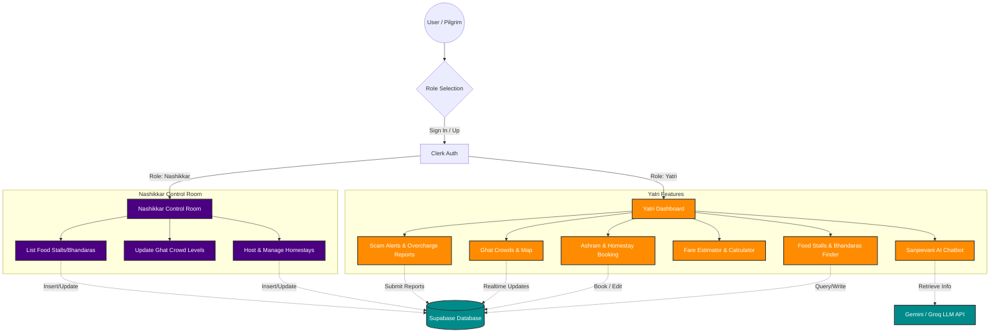

# 🕉️ KumbhAarambh (कुंभआरंभ)

> **The Ultimate Digital Companion & Host Control Room for the Nashik Kumbh Mela**
> A modern, hyper-interactive web platform designed to empower pilgrims (Yatris) with real-time navigation, food/stay finders, scam alerts, and AI assistance, while providing Nashik residents (Nashikkars) a unified control room to host and manage resources.

---

## 🌟 Overview & Core Vision
Kumbh Mela is one of the largest religious gatherings on Earth. Navigating the crowds, finding hygienic food, securing affordable stays, avoiding scams, and getting real-time assistance can be overwhelming. 

**KumbhAarambh** solves this by providing:
1. **Yatri Dashboard**: A mobile-optimized portal for pilgrims to search and filter authentic stays (ashrams, homestays), food spots (bhandaras, street food, clean dining), track Ghat crowds/shahi snan schedules, estimate transport fares, and report local scams.
2. **Nashikkar Control Room**: A dashboard for Nashik locals to register homestays, list food options, report crowd conditions, and support Yatris.
3. **Sanjeevani AI Chatbot**: An intelligent, multi-lingual pilgrim assistant answering queries about rituals, schedules, transport, and emergencies.

---

## 🛠️ Tech Stack & Architecture

| Layer | Technology | Description |
|---|---|---|
| **Frontend Framework** | **Next.js 15+ (App Router)** | For Server-Side Rendering (SSR), fast performance, and dynamic routing. |
| **Styling & UI** | **Vanilla CSS & Tailwind** | Custom premium visual language with high-fidelity glassmorphic effects, modern typography, and responsive layouts. |
| **Animations** | **Framer Motion** | Micro-interactions, smooth page transitions, and parallax scrolling interfaces. |
| **Authentication** | **Clerk Auth** | Secure multi-role onboarding (Yatri / Nashikkar). |
| **Database & Realtime** | **Supabase (PostgreSQL)** | Persistent storage for stays, food spots, bookings, crowd reports, and scams with Row-Level Security (RLS) policies. |
| **Maps & Geo-Tracking** | **Leaflet / React-Leaflet** | Dynamic interactive maps showing exact locations of food stalls, stays, and holy ghats (dynamically imported to bypass SSR overhead). |
| **AI Engine** | **Gemini & Groq API** | Powers **Sanjeevani Chatbot** for multi-lingual real-time guidance. |

---

## 📊 App Workflow & Architecture Flowchart



---

## ⚙️ Local Development Setup

Follow these steps to run the application locally:

### 1. Clone the Repository
```bash
git clone <your-repository-url>
cd kumbhaarambh
```

### 2. Install Dependencies
```bash
npm install
```

### 3. Database Initialization (Supabase)
1. Set up a free PostgreSQL database on [Supabase](https://supabase.com).
2. Go to the **SQL Editor** in your Supabase dashboard.
3. Paste and run the entire contents of the [`seed.sql`](file:///c:/Users/karpe/kumbhaarambh/seed.sql) file to create the tables, enable Row Level Security (RLS) policies, and populate mock data for Nashik's stays, street foods, ghats, and reports.

### 4. Configure Environment Variables
Create a `.env.local` or `.env` file in the root directory and add the following keys:

```env
# Clerk Authentication Configuration
NEXT_PUBLIC_CLERK_PUBLISHABLE_KEY=your_clerk_publishable_key
CLERK_SECRET_KEY=your_clerk_secret_key
NEXT_PUBLIC_CLERK_SIGN_IN_URL=/login
NEXT_PUBLIC_CLERK_SIGN_UP_URL=/register

# Supabase Configuration
NEXT_PUBLIC_SUPABASE_URL=https://your-project-ref.supabase.co
NEXT_PUBLIC_SUPABASE_ANON_KEY=your_supabase_anon_key

# AI Chatbot APIs (Optional / Recommended for Sanjeevani Chat)
GEMINI_API_KEY=your_gemini_api_key
GROQ_API_KEY=your_groq_api_key
```

### 5. Start the Development Server
```bash
npm run dev
```
Open [http://localhost:3000](http://localhost:3000) with your browser to experience the application.

---

## 🚀 Deployment Guide (Vercel)

KumbhAarambh is fully configured for deployment on the Vercel platform.

### Step 1: Push Your Code to GitHub / GitLab / Bitbucket
Make sure all your changes are committed and pushed to a remote repository:
```bash
git add .
git commit -m "feat: ready for vercel deployment"
git push origin main
```

### Step 2: Import the Project to Vercel
1. Log in to your [Vercel Dashboard](https://vercel.com).
2. Click **Add New** > **Project**.
3. Import your `kumbhaarambh` repository.

### Step 3: Configure Environment Variables
In the **Environment Variables** section of your Vercel project settings, add the key-value pairs matching your `.env.local`:
- `NEXT_PUBLIC_CLERK_PUBLISHABLE_KEY`
- `CLERK_SECRET_KEY`
- `NEXT_PUBLIC_CLERK_SIGN_IN_URL` (set to `/login`)
- `NEXT_PUBLIC_CLERK_SIGN_UP_URL` (set to `/register`)
- `NEXT_PUBLIC_SUPABASE_URL`
- `NEXT_PUBLIC_SUPABASE_ANON_KEY`
- `GEMINI_API_KEY`
- `GROQ_API_KEY`

### Step 4: Deploy
1. Click **Deploy**. Vercel will automatically build the Next.js pages and optimize assets.
2. Once the build finishes, Vercel will provide you with a live production URL!

---

## 🗃️ Database Schema Overview
The app operates on a PostgreSQL schema optimized for speed and real-time subscription updates:
- **`stays`**: Lodges, ashrams, homestays, pricing, coordinates, host contact, and availability.
- **`bookings`**: Pilgrim bookings with check-in details and statuses.
- **`food_spots`**: Traditional street food stalls, clean restaurants, sweet shops, free Bhandaras.
- **`reviews`**: Ratings and reviews for stalls and stays.
- **`ghats`**: Dynamic crowd statuses (Normal, Crowded, Heavily Crowded), shahi snan schedules, and map coordinates.
- **`overcharge_reports`**: Real-time reporting of scam hotspots and transport overcharging.
